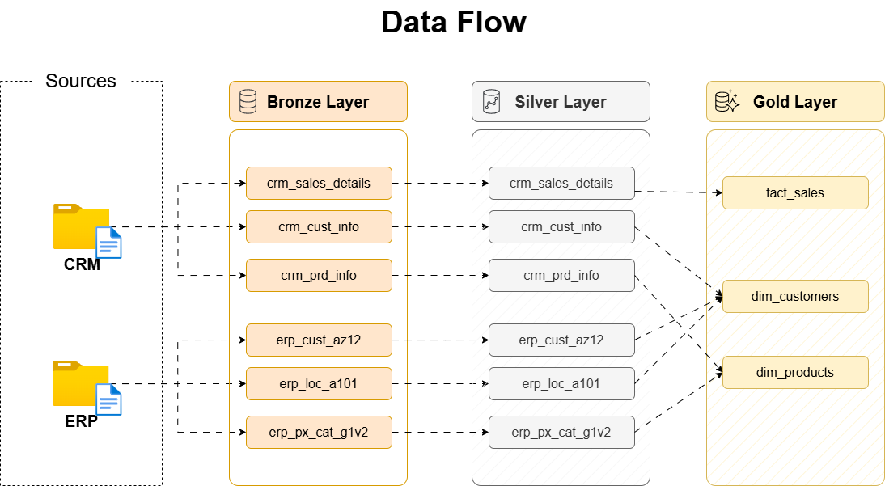
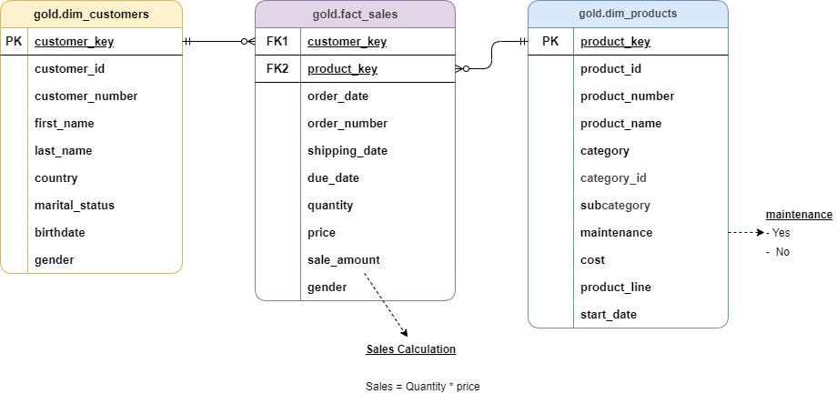

# SQL Warehouse Project

## Overview

The project demonstrates the design and implementation of a modern SQL Data Warehouse using the Medallion Architecture approach. The solution integrates data from CRM and ERP source systems, applies data quality controls, performs data transformations, and delivers business-ready datasets for analytics and reporting.

The project showcases core data engineering concepts including data ingestion, ETL development, data validation, dimensional modeling, and analytical data preparation.

---

##  📌 Project Goals

The objectives of this project are to:

* Build a multi-layered data warehouse architecture.
* Consolidate data from multiple source systems.
* Apply data cleansing and validation processes.
* Implement business rules and data standardization.
* Design dimensional models for analytical reporting.
* Demonstrate end-to-end SQL-based data engineering workflows.

---

##  🗺️ Architecture Overview

The warehouse follows the Medallion Architecture framework consisting of three layers:


### 🟠 Bronze Layer 

The Bronze Layer stores raw data ingested directly from source systems.

**Characteristics**

* Raw source records
* Minimal transformations
* Historical data preservation
* Initial landing zone for ingestion

---

### ⚪ Silver Layer

The Silver Layer contains cleansed, standardized, and validated data.

**Processing Activities**

* Data cleansing
* Duplicate removal
* Data type conversions
* Business rule enforcement
* Data standardization
* Data quality validation

---

### 🟡 Gold Layer

The Gold Layer contains business-ready analytical models.

**Components**

* Customer Dimension
* Product Dimension
* Sales Fact Table

The layer is designed using a Star Schema to support efficient reporting and dashboard development.

---


##  ♻️ Data Flow




---

##  💾 Data Sources

The project combines information from multiple operational systems.

| Source System | Dataset               | Description                                        |
| ------------- | --------------------- | -------------------------------------------------- |
| CRM           | Customer Information  | Customer master data                               |
| CRM           | Product Information   | Product master data                                |
| CRM           | Sales Details         | Transactional sales records                        |
| ERP           | Customer Demographics | Birthdate and gender information                   |
| ERP           | Customer Locations    | Geographic information                             |
| ERP           | Product Categories    | Product categorization and maintenance information |

---

## 🔁 ETL Process

The ETL pipeline follows a structured workflow:

### 1. Extract

Data is imported from CRM and ERP source files into the Bronze Layer.

### 2. Transform

The Silver Layer applies:

* Data cleansing
* Data validation
* Business rules
* Standardization
* Data enrichment

### 3. Load

The Gold Layer builds dimensional models optimized for analytical workloads.

---

##  💠 Data Model

### Star Schema




### Fact Table

| Table      | Description                                     |
| ---------- | ----------------------------------------------- |
| fact_sales | Stores transactional sales metrics and measures |

### Dimension Tables

| Table         | Description                 |
| ------------- | --------------------------- |
| dim_customers | Customer-related attributes |
| dim_products  | Product-related attributes  |


<!--
## 🟠 Bronze Layer

The Bronze Layer serves as the raw data storage layer.

### Source Tables

| Table Name        |
| ----------------- |
| crm_cust_info     |
| crm_prd_info      |
| crm_sales_details |
| erp_cust_az12     |
| erp_loc_a101      |
| erp_px_cat_g1v2   |

---

## ⚪ Silver Layer

The Silver Layer contains cleansed, validated, and enriched datasets.

### Key Transformations

| Transformation Category  | Description                                         |
| ------------------------ | --------------------------------------------------- |
| Data Cleansing           | Removal of duplicates and invalid values            |
| Data Standardization     | Standardized business attributes                    |
| Data Type Conversion     | Conversion of source formats into usable data types |
| Business Rule Validation | Enforcement of business logic                       |
| Data Quality Controls    | Validation of integrity and consistency             |
| Audit Tracking           | Warehouse load timestamps                           |

### Silver Layer Tables

| Table Name        |
| ----------------- |
| crm_cust_info     |
| crm_prd_info      |
| crm_sales_details |
| erp_cust_az12     |
| erp_loc_a101      |
| erp_px_cat_g1v2   |

---

## 🟡 Gold Layer

The Gold Layer provides business-ready datasets for analytics.

### Analytical Tables

| Table Name    | Type      |
| ------------- | --------- |
| dim_customers | Dimension |
| dim_products  | Dimension |
| fact_sales    | Fact      |

### Business Capabilities

* Revenue Analysis
* Product Performance Analysis
* Customer Segmentation
* Sales Trend Analysis
* Category Performance Analysis

-->
---

## 🗂️ Data Quality Framework

Data quality checks are implemented throughout the transformation process.

### Validation Categories

| Validation Area          | Purpose                                 |
| ------------------------ | --------------------------------------- |
| Primary Key Validation   | Detect duplicate identifiers            |
| Null Validation          | Ensure required values are populated    |
| Data Standardization     | Verify consistent attribute values      |
| Date Validation          | Validate date ranges and chronology     |
| Business Rule Validation | Confirm expected calculations           |
| Referential Integrity    | Verify dimension and fact relationships |

---

## 🧱 Project Structure


```text
sql-data-warehouse-project/
│
├── data/                                  # Source datasets used throughout the warehouse
│   ├── crm/                               # CRM source files
│   │   ├── cust_info.csv
│   │   ├── prd_info.csv
│   │   └── sales_details.csv
│   │
│   └── erp/                               # ERP source files
│       ├── CUST_AZ12.csv
│       ├── LOC_A101.csv
│       └── PX_CAT_G1V2.csv
│
├── docs/                                  # Documentation, diagrams, and schema references
│   ├── bronze/
│   │   ├── data_flow_bronze.drawio.png    # Bronze layer data flow diagram
│   │   ├── schema_bronze.png              # Bronze layer schema visualization
│   │   └── README.md                      # Bronze layer documentation
│   │
│   ├── silver/
│   │   ├── data_flow_silver.drawio.png    # Silver layer transformation flow
│   │   ├── silver_schema.png              # Silver layer schema visualization
│   │   └── README.md                      # Silver layer documentation
│   │
│   └── gold/
│       ├── data_flow_gold.drawio.png      # Gold layer processing flow
│       ├── data_model.png                 # Star schema / dimensional model
│       └── README.md                      # Gold layer documentation
│
├── warehouse_info/                        # Main diagrams and info used in project 
│   ├── Data_Architecture.drawio.png       # Overall warehouse architecture
│   └── data_flow.drawio.png               # End-to-end ETL workflow
│   └── data_layers.png                    # Information per layers in the data
│   └── etl_steps.drawio.png               # Guide flow of data from bronze to gold
|
├── scripts/                               # SQL scripts used for warehouse development
│   ├── bronze/
│   │   ├── ddl_bronze.sql                 # Bronze layer table definitions
│   │   └── load_bronze_data.sql           # Raw data loading procedures
│   │
│   ├── silver/
│   │   ├── ddl_silver.sql                 # Silver layer table definitions
│   │   └── load_silver_data.sql           # Data cleansing and transformation logic
│   │
│   └── gold/
│       └── ddl_gold.sql                   # Gold layer dimensional model creation
│
├── tests/                                 # Data quality and validation scripts
│   ├── silver_quality_check.sql           # Silver layer data validation framework
│   ├── gold_quality_check.sql             # Gold layer integrity validation
│   └── README.md                          # Testing documentation
│
├── README.md                              # Project overview and documentation
├── LICENSE                                # License information
└── .gitignore                             # Git ignored files and folders
```


---

##  👍 Skills Demonstrated

### Data Engineering

* Data Warehouse Design
* ETL Development
* Data Validation
* Data Quality Management
* Medallion Architecture

### SQL Development

* Complex Joins
* Common Table Expressions (CTEs)
* Window Functions
* Data Transformation


---

##  📚 Learnings

Through this project I gained hands-on experience with:

* Designing layered warehouse architectures
* Implementing ETL pipelines using SQL
* Building dimensional models for analytics
* Applying data quality frameworks
* Creating business-ready reporting structures
* Managing data transformations across multiple source systems

---

## ⚙️ Future Improvements 

Potential enhancements include:

* Incremental data loading
* Power BI dashboards
* Automated scheduling using Airflow
* CI/CD deployment workflows
* Data lineage monitoring
* AI and Machine learning

---

##  🙇🏻 Acknowledgements

I would like to express my sincere appreciation to 👑<u>**Baraa Khatib Salkini (Data With Baraa)**</u>👑 for providing exceptional educational content and practical guidance on data warehousing and data engineering concepts.

His project served as a strong learning foundation and helped me better understand ETL development, dimensional modeling, data quality validation, and warehouse architecture design.

The knowledge gained from his tutorials and project walkthroughs was instrumental in helping me successfully build and complete this end-to-end SQL Data Warehouse project.

